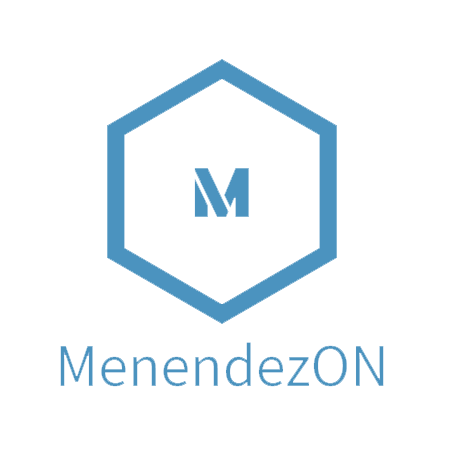

  
   

  <h3><b>Microverse Project</b></h3>

# 📗 Table of Contents

- [📖 About the Project](#about-project)
  - [🛠 Built With](#built-with)
    - [Tech Stack](#tech-stack)
    - [Key Features](#key-features)
  - [🚀 Live Demo](#live-demo)
- [💻 Getting Started](#getting-started)
  - [Setup](#setup)
  - [Prerequisites](#prerequisites)
  - [Install](#install)
  - [Usage](#usage)
  - [Run tests](#run-tests)
  - [Deployment](#triangular_flag_on_post-deployment)
- [👥 Authors](#authors)
- [🔭 Future Features](#future-features)
- [🤝 Contributing](#contributing)
- [⭐️ Show your support](#support)
- [🙏 Acknowledgements](#acknowledgements)
- [📝 License](#license)

# 📖 Microverse First Project 

**Microverse First Project** is a simple project using basic HTML/CSS, linters technology and github repo.

## 🛠 Built With 

### Tech Stack 

  
HTML/CSS

### Key Features 

- **HTML/CSS**
- **Linters**
- **Github**

(<a href="#readme-top">back to top</a>)

## 🚀 Live Demo 

- N/A

(<a href="#readme-top">back to top</a>)

## 💻 Getting Started 

To get a local copy up and running, follow these steps.

### Prerequisites

No prerequisite is required

### Setup

N/A

### Install

You don't have to install on this project

### Usage

N/A

### Run tests

N/A

### Deployment

You don't have to deploy this project, it's a simple project based on HTML/CSS

(<a href="#readme-top">back to top</a>)

## 👥 Authors 

👤 **Author1**

- GitHub: [@menendezon](https://github.com/menendezon)
- Twitter: [@menendezon](https://twitter.com/menendezon)
- LinkedIn: [MenendezON](https://linkedin.com/in/menendezon)

(<a href="#readme-top">back to top</a>)

## 🔭 Future Features 

- **Javascript**
- **Display images**
- **Responsible**

(<a href="#readme-top">back to top</a>)

## 🤝 Contributing 

Contributions, issues, and feature requests are welcome!

Feel free to check the [issues page](../../issues/).

(<a href="#readme-top">back to top</a>)

## ⭐️ Show your support 

If you like this project, please give stars.

(<a href="#readme-top">back to top</a>)

## 🙏 Acknowledgments 

I would like to thank...

(<a href="#readme-top">back to top</a>)

## 📝 License 

This project is [MIT](./LICENSE.md) licensed.

(<a href="#readme-top">back to top</a>)
